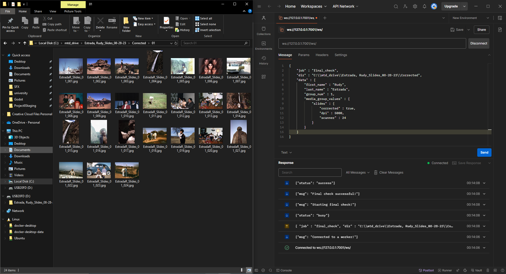
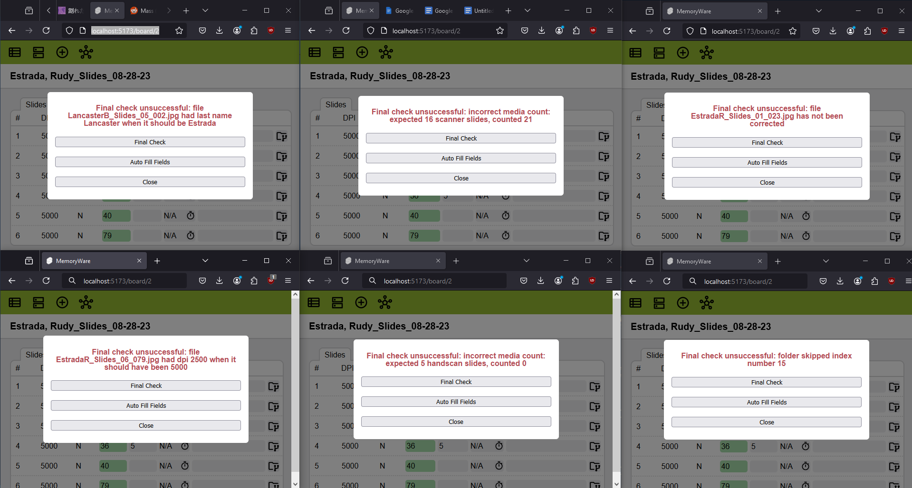
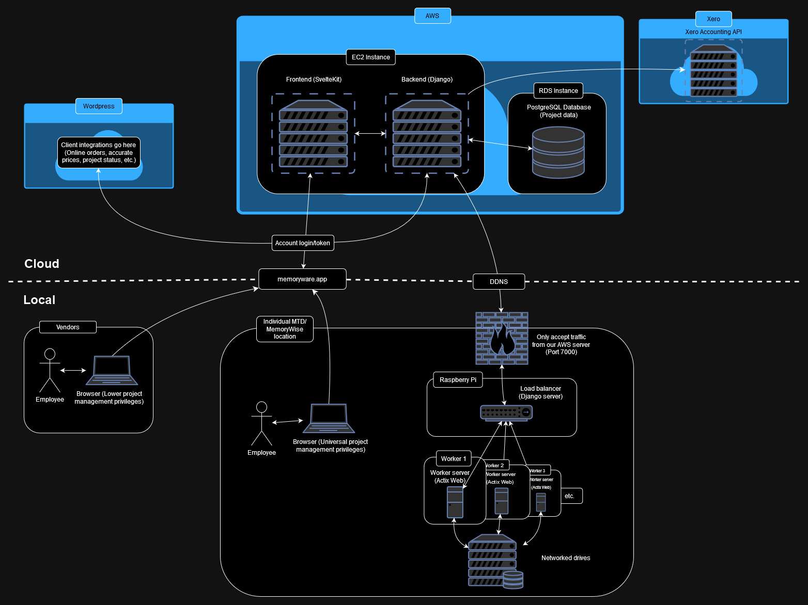

# MemoryWare Frontend

This is the frontend server for MemoryWare, a server network that automates and simplifies the entire project management process at [MemoryWise & Memories To Digital](https://memorywise.com/). Development began in ~May 2024 and is still underway, with plans to incorporate automatic media correction, file and folder management, Xero integrations and more.

Includes real-time updates of projects from the database and between clients. MemoryWare's backend services use Django (Python) and Actix Web (Rust), and are hosted locally or on AWS EC2 instances.

## Images

### Normal modes

### Editing modes

### File checking (Backend)

### Simplified network diagram
